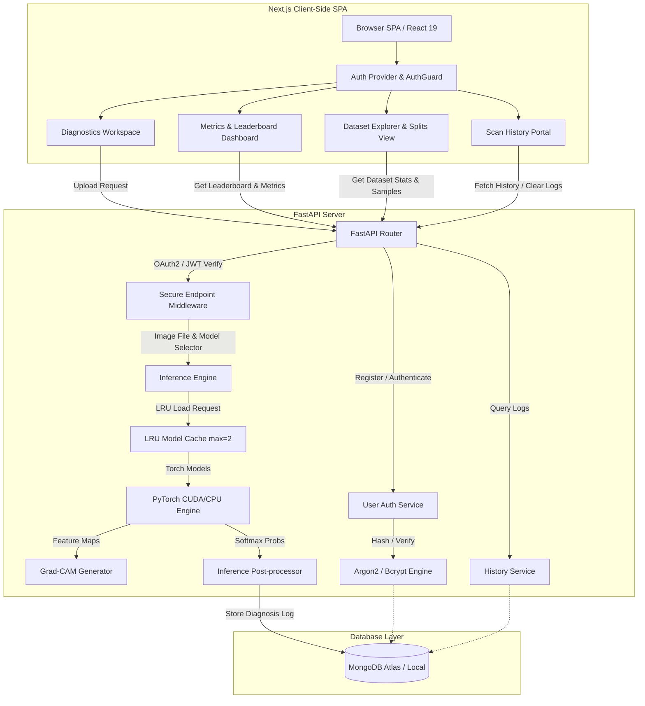

<div align="center">
  <div style="background-color: #0284c7; padding: 25px; border-radius: 24px; display: inline-block; margin-bottom: 20px; box-shadow: 0 10px 25px -5px rgba(2, 132, 199, 0.3);">
    
  </div>
  
  # RetinaAI: Deep Learning Platform for Diabetic Retinopathy
  
  **Research-grade clinical AI platform for automated retinal screening, multi-model evaluation, and explainable severity classification.**
  
  [](https://python.org)
  [](https://pytorch.org)
  [](https://fastapi.tiangolo.com)
  [](https://mongodb.com)
  [](https://nextjs.org)
  [](https://tailwindcss.com)
  [](https://opensource.org/licenses/MIT)
</div>

<hr style="border: 0; height: 1px; background: linear-gradient(to right, transparent, #e2e8f0, transparent); margin: 30px 0;"/>

## 🎯 Overview

Diabetic Retinopathy (DR) is a severe microvascular complication of diabetes mellitus, serving as a primary driver of preventable blindness in working-age populations globally. Early detection through regular retinal examinations is vital to mitigating visual loss. However, manual grading of high-resolution retinal fundus photographs is expensive, resource-intensive, and susceptible to observer variability.

**RetinaAI** addresses this challenge with a unified deep learning diagnostic suite. Migrated from a Flask architecture to a high-performance **FastAPI** backend and an interactive **Next.js** frontend, the system facilitates:
- **5-Class Severity Classification**: Maps scans into precise diagnostic groups (No DR, Mild, Moderate, Severe, Proliferative DR) rather than binary output.
- **Multi-Model Support**: Router handles 6 major deep learning architectures.
- **Ensemble Evaluation**: Processes images simultaneously through all active models to yield a robust majority vote and averaged probability distribution.
- **Explainable AI (Grad-CAM)**: Generates clinical attention heatmaps using activation mapping to isolate lesions, hemorrhages, and exudates.
- **Secure Diagnostics Portal**: Implements OAuth2/JWT session handling and MongoDB diagnosis logging.

---

## 🏗️ System Architecture

RetinaAI utilizes a separated client-server model optimized for deep learning inference latency, memory efficiency, and secure session management.



### Key Architectural Enhancements
1. **LRU Model Cache**: Rather than loading all 6 models into video memory (VRAM)—which easily crashes typical consumer GPUs—the backend employs a thread-safe Least Recently Used (LRU) cache (`ModelCache`) capped at **2 concurrent models**. When a new model is requested, the oldest is evicted, and garbage collection (`torch.cuda.empty_cache()`) is executed.
2. **FastAPI & Async IO**: Replaced the legacy Flask setup with FastAPI, enabling native async endpoint handling, strict request validation via Pydantic, and automatic OpenAPI schema generation.
3. **Data Integrity**: MongoDB ensures atomic logging of every screening. Scan logs include the original base64-compressed image, the associated Grad-CAM heatmap, prediction probabilities, and detailed timing metrics.

---

## 📊 Dataset & Preprocessing

The model training pipeline is configured for the **APTOS 2019 Blindness Detection** dataset (3,662 high-resolution retinal fundus images). 

### Data Engineering Details
- **Data Splits**: 70% Training (2,563 images), 15% Validation (549 images), and 15% Testing (550 images), executed via stratified splits to maintain uniform class distributions.
- **Class Imbalance Mitigation**: Class distributions are heavily skewed toward class `0` (No DR). To counteract this, training uses a custom **Focal Loss ($\gamma=2.0$)** with dynamic class weights computed from the inverse frequency of training labels.
- **Transformations (Training)**:
  - Resize to $224 \times 224$ pixels.
  - `RandomHorizontalFlip` (p=0.5).
  - `RandomRotation(15°)` to simulate camera misalignment.
  - `ColorJitter` (brightness=0.2, contrast=0.2, saturation=0.2, hue=0.1) for lighting variations.
  - `RandomResizedCrop(224, scale=(0.8, 1.0))` to simulate zoom levels.
  - Normalization using ImageNet statistics: $\mu = [0.485, 0.456, 0.406]$, $\sigma = [0.229, 0.224, 0.225]$.
- **Transformations (Validation/Testing/Inference)**: Resize to $224 \times 224$ and normalize.

---

## 🧠 Evaluated Architectures & Performance

The platform evaluates six neural network architectures, fine-tuned from ImageNet pre-trained weights using the AdamW optimizer ($lr = 10^{-4}$) and a `ReduceLROnPlateau` scheduler.

| Model | Model Key | Parameter Count | Flops | Key Architectural Innovation | Test Accuracy | F1-Score | ROC-AUC | Inference Speed |
| :--- | :--- | :--- | :--- | :--- | :--- | :--- | :--- | :--- |
| **EfficientNet-B3** 🏆 | `efficientnet_b3` | 10.7M | 1.8 GFLOPs | Compound Scaling (Depth, Width, Resolution) | **76.3%** | **0.773** | 0.915 | Medium |
| **DenseNet-121** | `densenet121` | 6.9M | 2.9 GFLOPs | Dense Blocks (Feature reuse via concatenation) | 74.0% | 0.751 | 0.909 | Medium |
| **MobileNetV3-Large** | `mobilenet_v3_large`| 4.2M | 0.2 GFLOPs | NetAdapt, Squeeze-and-Excitation, h-swish | 73.6% | 0.747 | 0.907 | **Very Fast** |
| **ResNet-50** | `resnet50` | 23.5M | 4.1 GFLOPs | Residual skip connections to combat vanishing gradients | 70.7% | 0.723 | 0.898 | Fast |
| **EfficientNet-B0** | `efficientnet_b0` | 4.0M | 0.4 GFLOPs | Baseline compound scaling architecture | 68.1% | 0.690 | 0.918 | Fast |
| **ViT-B/16** | `vit_b_16` | 85.8M | 17.6 GFLOPs| Multi-head self-attention on patch embeddings | 68.1% | 0.690 | **0.923** | Slow |

### Clinical Performance Notes
- **EfficientNet-B3** represents the optimal balance, obtaining the highest accuracy and weighted F1-score.
- **Vision Transformer (ViT-B/16)** achieves the highest ROC-AUC ($0.923$), showing outstanding class-separation capacity, but exhibits lower overall test accuracy. This is a common characteristic of Transformers trained on small datasets without massive data augmentations.
- **MobileNetV3** serves as the optimal choice for resource-constrained or mobile deployments, demonstrating negligible loss in accuracy while maintaining a minute footprint (4.2M parameters).

---

## 🛠️ Technology Stack & Dependencies

### Backend Stack
- **Framework**: FastAPI (python-multipart for multipart uploads, uvicorn for execution)
- **Deep Learning**: PyTorch, Torchvision
- **Explainable AI**: `pytorch-grad-cam` (Grad-CAM, Layer-CAM, etc.)
- **Security**: `python-jose[cryptography]` (JWT token signatures), `passlib[argon2,bcrypt]` (password hashing)
- **Database Connector**: `pymongo` (MongoDB communication)
- **Scientific Python**: `numpy`, `pandas`, `scikit-learn`, `pillow`, `opencv-python`
- **Visualization**: `matplotlib`, `seaborn`

### Frontend Stack
- **Framework**: Next.js 16 (App Router, React 19, TSX)
- **Styling**: Tailwind CSS v4 (native CSS configuration)
- **Animations**: Framer Motion 12
- **Data Charts**: Recharts 3
- **Icons**: Lucide React

---

## 🔒 Security & Database Model

### Authentication Protocol
RetinaAI uses **OAuth2 with Password Flow and JWT tokens**. 
1. The frontend logs in via `/token` using application/x-www-form-urlencoded credentials.
2. The password is verified against stored hashes using **Argon2** (default) or **Bcrypt** (fallback).
3. A JWT token is generated containing the user's username (`sub` claim) and set to expire in 30 minutes.
4. Subsequent protected API calls include the JWT in the `Authorization: Bearer <token>` header.

### MongoDB Collections Schema

#### `users` Collection
Stores user registration data. Has unique indexes on `username` and `email`.
```json
{
  "_id": "ObjectId",
  "username": "saadahmed",
  "email": "saad@example.com",
  "hashed_password": "$argon2id$v=19$m=65536,t=3,p=4$...",
  "created_at": "ISODate"
}
```

#### `diagnoses` Collection
Logs prediction records. Indexed on `(user_id, timestamp)` for history searches.
```json
{
  "_id": "ObjectId",
  "user_id": "ObjectId(users._id)",
  "timestamp": "ISODate",
  "model_used": "EfficientNet-B3",
  "model_name": "efficientnet_b3",
  "predicted_class": "Moderate",
  "predicted_class_raw": "Moderate",
  "confidence_score": 0.884,
  "is_diabetic": true,
  "inference_time_ms": 142.5,
  "gradcam_image": "data:image/jpeg;base64,...",
  "original_image": "data:image/jpeg;base64,..."
}
```

---

## 🔌 API Documentation

### 🔑 Authentication Endpoints

#### Register Account
`POST /register`
- **Request Body**: `JSON`
  ```json
  {
    "username": "doctor_xyz",
    "email": "xyz@clinic.com",
    "password": "strongpassword123"
  }
  ```
- **Responses**: 
  - `201 Created`: `{"message": "User registered successfully"}`
  - `400 Bad Request`: Username or Email already exists.

#### Obtain Session Token
`POST /token`
- **Request Body**: `application/x-www-form-urlencoded`
  - `username`: `doctor_xyz`
  - `password`: `strongpassword123`
- **Responses**:
  - `200 OK`: `{"access_token": "eyJhbGci...", "token_type": "bearer"}`
  - `401 Unauthorized`: Invalid credentials.

---

### 👁️ Core Diagnostic Endpoints

#### Single Model Inference (Protected)
`POST /predict`
- **Headers**: `Authorization: Bearer <token>`
- **Request Form**: `multipart/form-data`
  - `file`: (Binary image file)
  - `model`: (Optional. e.g. `efficientnet_b3`. Defaults to best model).
- **Responses**:
  - `200 OK`:
    ```json
    {
      "model_name": "efficientnet_b3",
      "display_name": "EfficientNet-B3",
      "predicted_class": "Moderate",
      "predicted_class_display": "Moderate",
      "predicted_class_index": 2,
      "confidence": 0.884,
      "is_diabetic": true,
      "severity_color": "#f97316",
      "message": "Detected Moderate",
      "probabilities": { "No_DR": 0.01, "Mild": 0.05, "Moderate": 0.884, ... },
      "probabilities_display": { "No DR": 0.01, "Mild": 0.05, "Moderate": 0.884, ... },
      "inference_time_ms": 142.5,
      "grad_cam": "data:image/jpeg;base64,...",
      "original_image": "data:image/jpeg;base64,...",
      "model_params": 10700000,
      "model_accuracy": 0.763
    }
    ```

#### Ensemble Multi-Model Comparison (Protected)
`POST /predict/compare`
- **Headers**: `Authorization: Bearer <token>`
- **Request Form**: `multipart/form-data`
  - `file`: (Binary image file)
- **Responses**:
  - `200 OK`:
    ```json
    {
      "results": [
        { "model_name": "resnet50", "predicted_class_display": "Moderate", ... },
        { "model_name": "efficientnet_b3", "predicted_class_display": "Moderate", ... }
      ],
      "total_inference_time_ms": 782.1,
      "num_models": 6,
      "majority_vote": {
        "predicted_class": "Moderate",
        "predicted_class_display": "Moderate",
        "agreement_ratio": 0.83,
        "is_diabetic": true,
        "severity_color": "#f97316"
      },
      "ensemble": {
        "predicted_class": "Moderate",
        "predicted_class_display": "Moderate",
        "confidence": 0.825,
        "is_diabetic": true,
        "probabilities": { ... },
        "probabilities_display": { ... },
        "severity_color": "#f97316"
      },
      "original_image": "data:image/jpeg;base64,..."
    }
    ```

---

### 📊 Dashboard & History Endpoints

#### Get Leaderboard (Protected)
`GET /api/dashboard/leaderboard`
- **Headers**: `Authorization: Bearer <token>`
- **Response**: List of trained models, parameters, accuracy, training time, etc.

#### Get Model Test Metrics (Protected)
`GET /api/dashboard/metrics/{model_name}`
- **Headers**: `Authorization: Bearer <token>`
- **Response**: Exact loss, precision, recall, F1, and per-class metrics from training logs.

#### Get Scan History (Protected)
`GET /history`
- **Headers**: `Authorization: Bearer <token>`
- **Response**: JSON array containing up to 100 historical scans for the user, containing prediction dates, model types, probabilities, base64 images, and Grad-CAM maps.

#### Clear Scan History (Protected)
`DELETE /history`
- **Headers**: `Authorization: Bearer <token>`
- **Response**: `{"message": "Successfully deleted X records"}`

---

### 📂 Dataset Statistics Endpoints (Public)

#### Dataset Summary Stats
`GET /api/dataset/stats`
- **Response**: Total image counts, class names, train/val/test splits, image distributions, augmentations list.

#### Get Random Class Samples
`GET /api/dataset/samples/{class_name}`
- **Parameters**: `count` (Optional, default=4, max=8)
- **Response**: Base64 images corresponding to random examples of the requested class.

---

## ⚙️ Configuration & Environment Variables

Create a file named `.env` in the root directory. Add the following parameters:

```env
# MongoDB Connection String (Atlas cluster or Local MongoDB instance)
MONGODB_URI=mongodb+srv://<username>:<password>@cluster.mongodb.net/?appName=RetinaAI
DB_NAME=Retina-AI

# JWT Security Signature Parameters (Use a long random hex key in production)
JWT_SECRET_KEY=a3f8b2c1d4e5f6a7b8c9d0e1f2a3b4c5d6e7f8a9b0c1d2e3f4a5b6c7d8e9f0a1
JWT_ALGORITHM=HS256
ACCESS_TOKEN_EXPIRE_MINUTES=30
```

---

## 🚀 Installation & Setup

### Prerequisites
- **Python**: 3.10 or higher
- **Node.js**: 18 or higher
- **MongoDB**: A running MongoDB instance (Atlas Cloud database or Local service)
- **Git LFS**: Required to download binary model checkpoint weights (`.pth` files)

---

### Step 1: Clone Repository and Fetch Model Checkpoints
Ensure Git LFS is installed on your OS.
```bash
# Clone the repository
git clone https://github.com/yourusername/diabetic-retinopathy.git
cd diabetic-retinopathy

# Initialize and pull deep learning weight files
git lfs install
git lfs pull
```

---

### Step 2: Backend Setup
Configure your virtual environment and install packages.
```bash
# Create a virtual environment
python -m venv venv

# Activate virtual environment
# Windows:
venv\Scripts\activate
# Linux/macOS:
source venv/bin/activate

# Install requirements
pip install -r requirements.txt

# Run the FastAPI server in development mode
python app.py
```
*The API is now running locally on: **http://localhost:8000** (Automatic OpenAPI documentation available at http://localhost:8000/docs)*

---

### Step 3: Frontend Setup
Open a new terminal window, navigate to the frontend folder, and launch the dev environment.
```bash
cd frontend

# Install package dependencies
npm install

# Run the Next.js development server
npm run dev
```
*The client-side interface is now running on: **http://localhost:3000***

---

### Step 4: Testing & Inference Verification
The platform contains a dedicated folder named [evaluator_samples](file:///c:/Users/Saad/Desktop/Web%20Project/Diabetic-Retinopathy/evaluator_samples) containing sample fundus images. 
1. Log into RetinaAI (or create a new user profile on the register page).
2. Go to the main Diagnostic Portal.
3. Click "Upload Scan" and navigate to the `evaluator_samples` folder.
4. Select one of the images (e.g., `000c1434d8d7.png`).
5. Choose an evaluation architecture (or click **Compare All**).
6. Press **Analyze Image** to view the resulting diagnosis class, probabilities distribution graph, and overlayed Grad-CAM heatmap.

---

## 🔬 Model Training Pipeline

If you want to train models from scratch or fine-tune models on customized fundus datasets:
1. Put the dataset images under `Dataset/colored_images/<class_name>/`.
2. Save your dataset labels map inside `train.csv`.
3. Open `training_pipeline/train.py` and verify `CSV_PATH` and `IMAGE_DIR` reference correct local folders.
4. Activate the virtual environment and execute:
```bash
cd training_pipeline
python train.py
```

`train.py` automatically performs:
- Stratified dataset partitioning (70/15/15).
- Train/Val/Test distribution plots rendering.
- Model training with early stopping on validation loss, ReduceLROnPlateau scheduling, and Focal Loss.
- Model testing metrics reporting (saved in `training_pipeline/logs/`).
- Confusion matrices plotting (saved in `training_pipeline/plots/`).
- Automated selection and registration of the best model (copied to `models/best_model.pth`).

---

## ⚠️ Medical Disclaimer
This software is a research prototype intended for **educational and research purposes only**. It is not an FDA-approved medical device and must not be used for primary clinical diagnostic decisions. All diagnosis predictions and visual heatmaps must be verified by a licensed healthcare professional or qualified ophthalmologist.

## 📄 License
Licensed under the [MIT License](file:///c:/Users/Saad/Desktop/Web%20Project/Diabetic-Retinopathy/LICENSE). See the LICENSE file for details.
