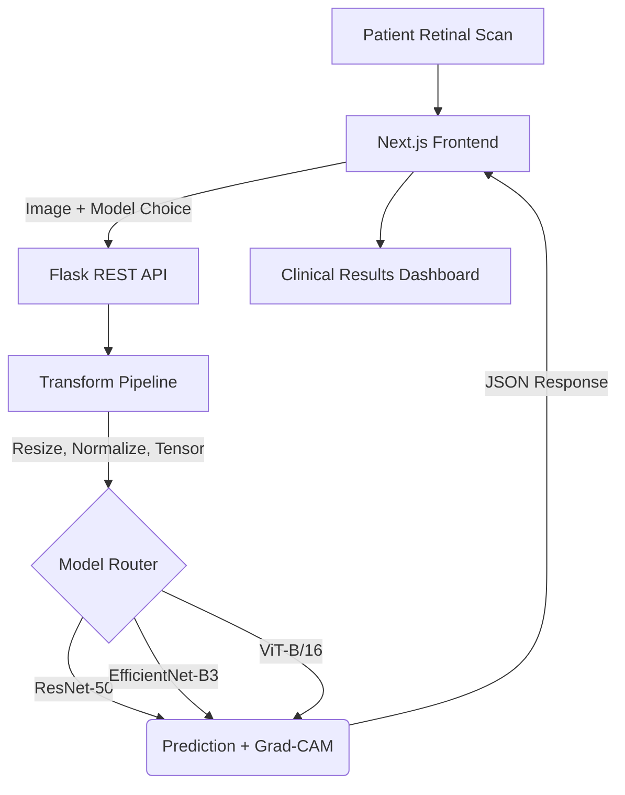

<div align="center">
  <div style="background-color: #0284c7; padding: 20px; border-radius: 20px; display: inline-block; margin-bottom: 20px;">
    
  </div>
  
  # RetinaAI: Deep Learning for Diabetic Retinopathy
  
  **Research-grade AI platform for automated retinal screening and severity classification.**

  [](https://python.org)
  [](https://pytorch.org)
  [](https://nextjs.org)
  [](https://tailwindcss.com)
  [](https://opensource.org/licenses/MIT)
</div>

<hr/>

## 🎯 Overview

Diabetic retinopathy (DR) is a leading cause of blindness worldwide. Early detection is critical, but manual grading of retinal fundus images is time-consuming and prone to human error. 

**RetinaAI** is an end-to-end research platform that automates DR screening using state-of-the-art computer vision models. It evaluates 6 different deep learning architectures, providing not just binary detection, but **5-level severity classification** and **Grad-CAM explainability heatmaps** to build clinical trust.

### ✨ Key Features
- **Multi-Model Inference API**: Choose between ResNet, EfficientNet (B0/B3), DenseNet, MobileNet, or ViT.
- **Ensemble "Compare All" Mode**: Run inference sequentially across all 6 architectures for a majority vote.
- **Grad-CAM Explainability**: Visualizes the exact lesions/exudates triggering the prediction.
- **Interactive Dashboards**: Browse training metrics, confusion matrices, and learning curves dynamically.
- **Dataset Explorer**: Explore class distributions and view sample augmented images.
- **Patient History**: Local browser storage of past scans with CSV export.

---

## 🏗️ Architecture



---

## 📊 Dataset & Preprocessing

Trained on the **APTOS 2019 Blindness Detection** dataset (3,662 high-resolution images).
- **Split**: 70% Train / 15% Validation / 15% Test (Stratified)
- **Classes**: No DR (0), Mild (1), Moderate (2), Severe (3), Proliferative DR (4)
- **Loss Function**: Focal Loss (γ=2.0) with dynamic class weighting to handle severe imbalance.
- **Transformations**: Resize(224x224), RandomHorizontalFlip, RandomRotation(15°), ColorJitter, ImageNet Normalization.

---

## 🧠 Evaluated Architectures & Results

All models were fine-tuned from ImageNet checkpoints using AdamW (lr=1e-4) and ReduceLROnPlateau scheduling.

| Model | Params | Test Accuracy | F1-Score | ROC-AUC | Inference Speed |
|-------|--------|---------------|----------|---------|-----------------|
| **EfficientNet-B3** 🏆 | 10.7M | **76.3%** | **0.773** | 0.915 | Medium |
| **DenseNet-121** | 6.9M | 74.0% | 0.751 | 0.909 | Medium |
| **MobileNetV3-Large** | 4.2M | 73.6% | 0.747 | 0.907 | **Very Fast** |
| **ResNet-50** | 23.5M | 70.7% | 0.723 | 0.898 | Fast |
| **EfficientNet-B0** | 4.0M | 68.1% | 0.690 | 0.918 | Fast |
| **ViT-B/16** | 85.8M | 68.1% | 0.690 | **0.923** | Slow |

*Note: ViT-B/16 achieves the highest ROC-AUC indicating excellent separation capability, but struggles with raw accuracy on this small dataset without heavier augmentation.*

---

## 🚀 Installation & Setup

### Prerequisites
- Python 3.10+
- Node.js 18+
- Git LFS (for downloading the `.pth` model weights)

### 1. Clone & Fetch Models
```bash
git clone https://github.com/yourusername/diabetic-retinopathy.git
cd diabetic-retinopathy
git lfs pull  # Crucial: Downloads the trained .pth model files
```

### 2. Backend Setup
```bash
python -m venv venv
source venv/bin/activate  # On Windows: venv\Scripts\activate
pip install -r requirements.txt
python app.py
```
*API runs on http://localhost:5000*

### 3. Frontend Setup
```bash
cd frontend
npm install
npm run dev
```
*App runs on http://localhost:3000*

---

## ⚠️ Medical Disclaimer
This software is a research prototype intended for **educational and research purposes only**. It is not an FDA-approved medical device and must not be used for primary diagnostic purposes. Always consult a qualified ophthalmologist.

## 📄 License
MIT License. See `LICENSE` for details.
